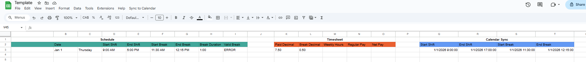

# Timesheet Tracker & Automated Notification

- Be able to fill in timesheet accurately using auto-filled data with the help of custom functions in Google Sheets and Apps Script (written in JavaScript)
- Add information from Google Sheets to Google Calendar for convenient schedule tracking and notification alerts to your phone for upcoming events

## IMPORTANT - Backup Your Calendar
- Always backup your calendar before you run the calendar sync function.

### Export Calendar
- Go to Settings - Settings for my calendars - `Your calendar`
- Click on `Export Calendar` to get the `.ics` file.

### Import Calendar
- To revert to the backup calendar, go to Settings - Import and Export
- Select file from your computer to be the `.ics` file and click `Import`.

## Getting Started

### 1. Update Google Sheets Data
- Fill in the following data fields as datetime format in Google Sheets:
  - Calendar Sync - Start Shift
  - Calendar Sync - End Shift
  - Calendar Sync - Start Break
  - Calendar Sync - End Break

### 2. Update Apps Script Data
- Add the range data of `Calendar Sync` to the `DATE_RANGE` variable within Apps Script
    - eg. `const DATE_RANGE = "Q3:T40";`
- Update the `CALENDAR_ID` for Apps Script
    - Get calendar ID from Google Calendar (Settings - Settings for my calendars - `Your calendar` - Integrate calendar)

### 3. Sync Calendar to Google Sheets
- Go to `Sync to Calendar - Add Events to Calendar`
- May need to give permissions for google sheets to access google calendar.

### 4. Add notification to events in Google Calendar
- You will only need to do this once
- Go to Settings for your Calendar Profile
- Add `Event notification` to (eg. 15 minutes) before event start
- Remove `All-day event notifications`

### 5. Phone notification setup for Google Calendar
- You will only need to do this once
- Go to Settings - `Your Schedule` and enable the `Enable Sync` option
- Make sure `Default notifications` is set to `15 minutes before` and `All-day Events` has no notifications

## Creating a Google Sheet Template
- Refer to [Google Sheets Template Data](#google-sheets-template-data) for details on the template data.

### 1. Add script to Google Sheet
- Go to `Extensions - Apps Script`
  - May need to open within browser incognito mode to work
- Add the provided `.gs` file

### 2. Add custom named functions
- Go to `Data - Named Functions`
- Click on create a new function
- Use the details from [Named Functions](#named-functions) to fill in the fields.

### 3. Filling in the cells
- Use the details from [Formats and Functions](#formats-and-functions) to fill in the fields.
- Automated cells will need a custom named function
- May need to format the data to (eg. Plain Text / Number / Date Time)
  - Go to `Format - Number` and select the needed format or create a custom format

## Google Sheets Template Data

### Formats and Functions

#### Schedule
- Notes (Plain Text)
- Date
  - Custom date time format: `Month (Aug) Day (5)`
  - Plain Text: `Sunday`
- Start Shift (Plain Text) - `=GET_MY_TIME(Q3)`
- End Shift (Plain Text) - `=GET_MY_TIME(R3)`
- Start Break (Plain Text) - `=GET_MY_TIME(S3)`
- End Break (Plain Text) - `=GET_MY_TIME(T3)`
- Break Duration (Plain Text) - `=GET_BREAK_DURATION(Q3, R3)`
- Valid Break (Plain Text) - `=VALID_BREAK_CHECK(Q3, R3, S3, T3)`

#### Timesheet
- Hours Decimal (Number) - `=GET_PAY_DECIMAL(Q3, R3)`
- Meal Duration (Number) - `=GET_BREAK_DECIMAL(Q3, R3)`
- Weekly Hours (Number) - `=GET_WEEKLY_HOURS(K3:K9)`
- Regular Pay (Number) - `=GET_REGULAR PAY(M3:M16)`
- Net Pay (Number)

#### Calendar Sync
- Start Shift (eg. 1/1/2000 9:00:00)
  - Custom date time format: `Month (8)/Day (5)/Year (1930) Hour (1):Minute (01):Second (01)`
- End Shift (eg. 1/1/2000 17:00:00)
  - Custom date time format: `Month (8)/Day (5)/Year (1930) Hour (1):Minute (01):Second (01)`
- Start Break (eg. 1/1/2000 12:00:00)
  - Custom date time format: `Month (8)/Day (5)/Year (1930) Hour (1):Minute (01):Second (01)`
- End Break (eg. 1/1/2000 13:00:00)
  - Custom date time format: `Month (8)/Day (5)/Year (1930) Hour (1):Minute (01):Second (01)`

### Named Functions

#### GET_BREAK_DECIMAL(startshift, endshift)
- Function Description: Gets the break duration in decimal format based on work duration without break.
- Argument Description
  - startshift: The starting shift time.
  - endshift: The ending shift time.
- Formula Definition: =JS_GET_BREAK_DECIMAL(startshift, endshift)

#### GET_BREAK_DURATION(startshift, endshift)
- Function Description: Gets the break duration in time format (HH:MM) based on work duration without break.
- Argument Description
  - startshift: The starting shift time.
  - endshift: The ending shift time.
- Formula Definition: =JS_GET_BREAK_DURATION(startshift, endshift)

#### GET_MY_TIME(datetime)
- Function Description: Convert date time format to readable time format.
- Argument Description
  - datetime: A given date in the following format eg. (1/1/2026 9:00:00)
- Formula Definition: =JS_GET_MY_TIME(datetime)

#### GET_PAY_DECIMAL(startshift, endshift)
- Function Description: Gets the total paid hours in decimal format based on work and break durations.
- Argument Description
  - startshift: The starting shift time.
  - endshift: The ending shift time.
- Formula Definition: =JS_GET_PAY_DECIMAL(startshift, endshift)

#### GET_REGULAR_PAY(rangehours)
- Function Description: Gets the total paid amount for biweekly based on total paid hours.
- Argument Description
  - rangehours: The sum of all hours in the biweekly section.
- Formula Definition: =JS_GET_REGULAR_PAY(rangehours)

#### GET_WEEKLY_HOURS(rangehours)
- Function Description: Gets weekly hours in decimal format for the sum of paid hours.
- Argument Description
  - rangehours: The sum of all hours in the weekly section.
- Formula Definition: =JS_GET_WEEKLY_HOURS(rangehours)

#### VALID_BREAK_CHECK(startshift, endshift, startbreak, endbreak)
- Function Description: Check if the given break time is valid.
- Argument Description
  - startshift: The starting shift time.
  - endshift: The ending shift time.
  - startbreak: The starting break time.
  - endbreak: The ending break time.
- Formula Definition: =JS_VALID_BREAK_CHECK(startshift, endshift, startbreak, endbreak)
